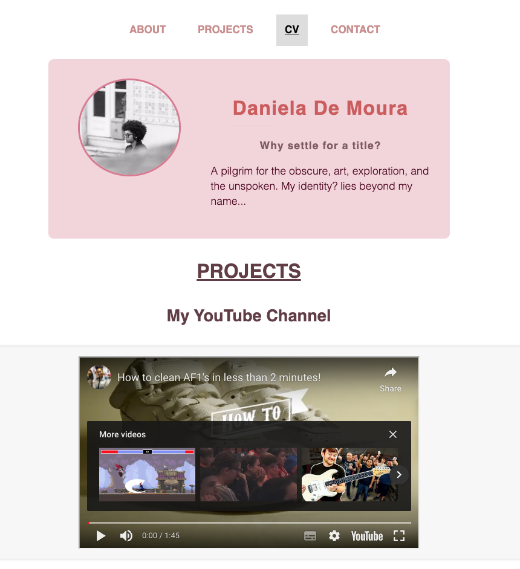
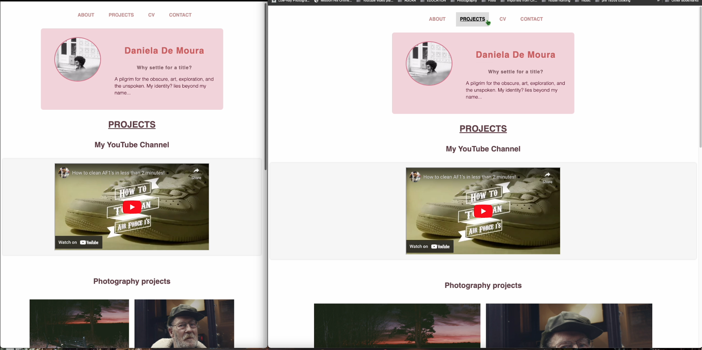
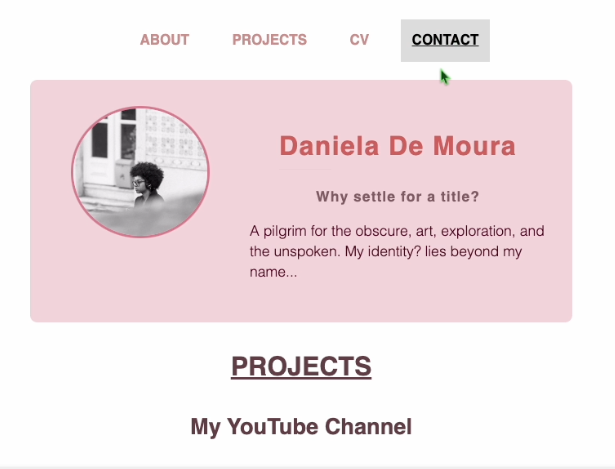
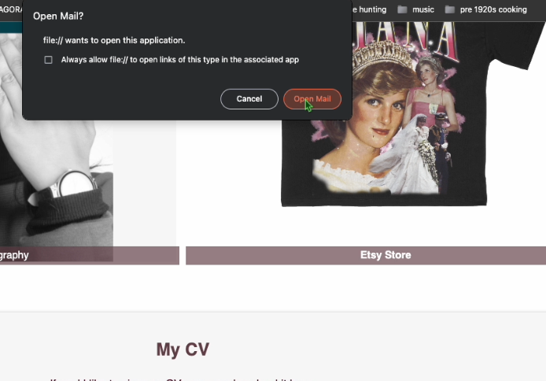
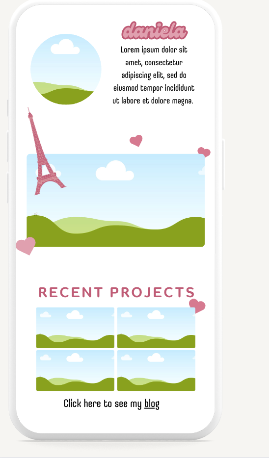
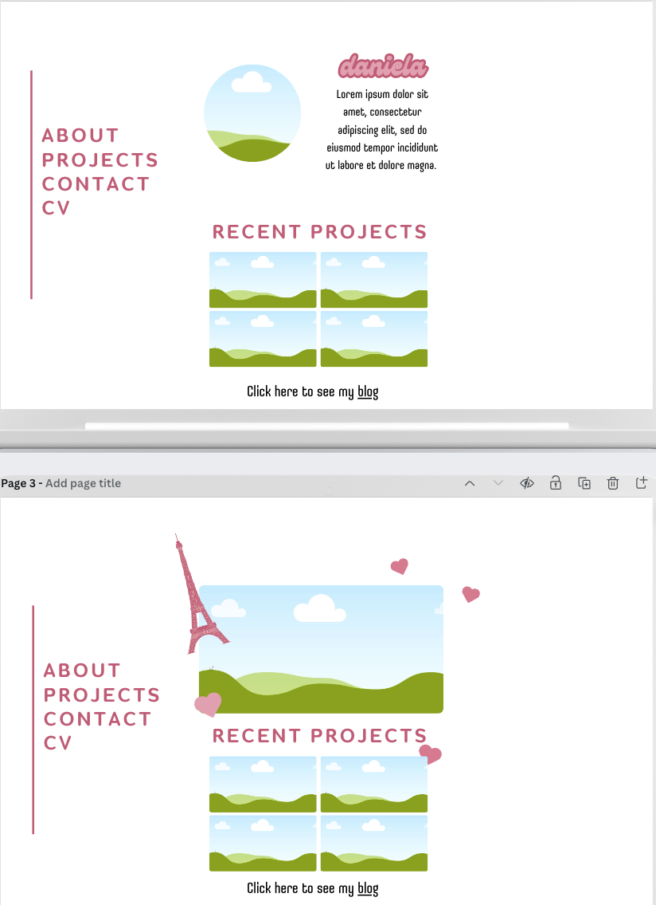

# Welcome to www.danielamoura.com my portfolio

## Copyright Notice

All content, including but not limited to text, images, graphics, and other media featured on this website, is protected by the Copyright, Designs and Patents Act 1988. This includes the following rights:

- [**Copyright Ownership:**](https://www.gov.uk/government/publications/copyright-acts-and-related-laws). All content on this website is owned by Daniela A. Mendes Penelas De Moura, the creator and owner of this website.

- [**Usage Restrictions:**](https://www.gov.uk/government/publications/copyright-acts-and-related-laws). Without explicit permission from Daniela A. Mendes Penelas De Moura, you are not allowed to use, reproduce, distribute, or modify any content found on this website. This includes but is not limited to text, photographs, artworks, and any other creative works.

- Any breaches will result in immediate legal action.

## Respect for Copyright

As a photographer and artist, I have put significant time, effort, and creativity into producing the content on this website. It's essential to respect the intellectual property rights of creatives. If you wish to use any content from this website for any purpose, please contact me for permission and licensing details.

## Contact Information

For inquiries regarding the use of content from this website, permissions, or any other questions, please feel free to get in touch with me:

- **Email:** themoney@duck.com

I appreciate your respect for my work and your understanding of the importance of protecting the rights of artists. Thank you for visiting my website.

Daniela A. Mendes Penelas De Moura
www.danielamoura.com

For more information on copyright acts and related laws, you can visit the [official government page](https://www.gov.uk/government/publications/copyright-acts-and-related-laws).

# Use Guide:

## What has links?

The CV section, all the main sections with a pink underline, the video section, and the t-shirt image.

# Photos of the website:

  

## Files:

HTML is named index.html.

CSS is stored under assets.

## Design Process:

This was my original vision for my website. Sadly due to time constraints and skill-level I had to abandon my original plan. I tried to keep it as close as the original by maintaining the same colour scheme and other aspects of the theme such as a sans-serif font.

 